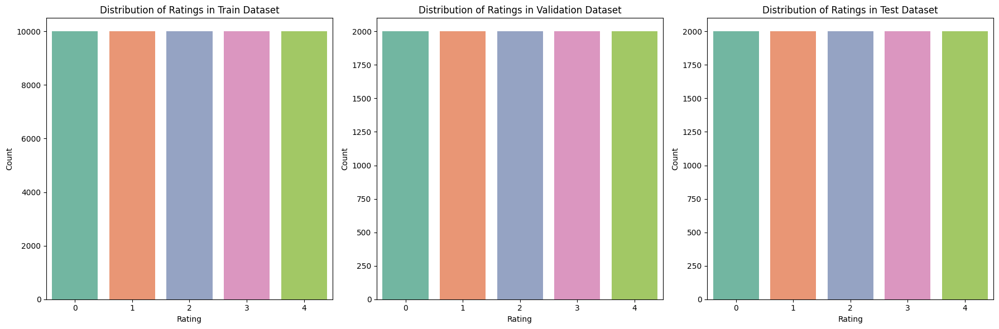
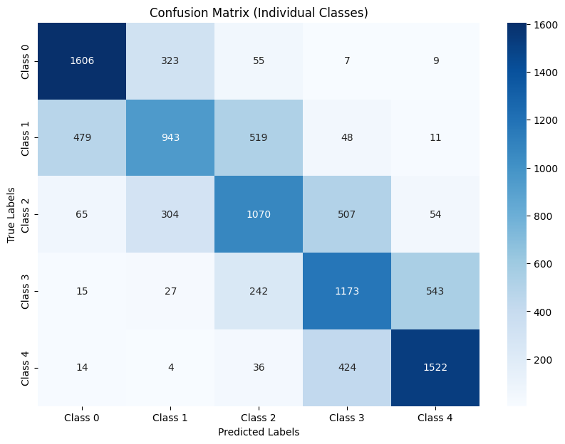
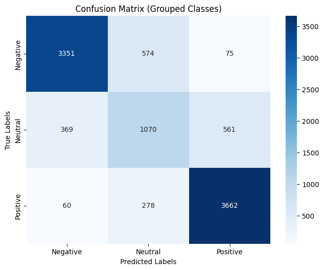
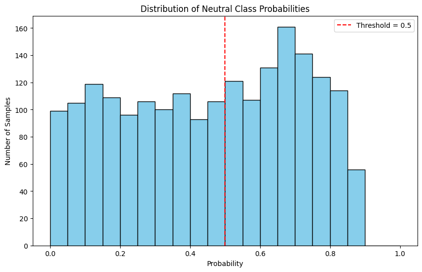
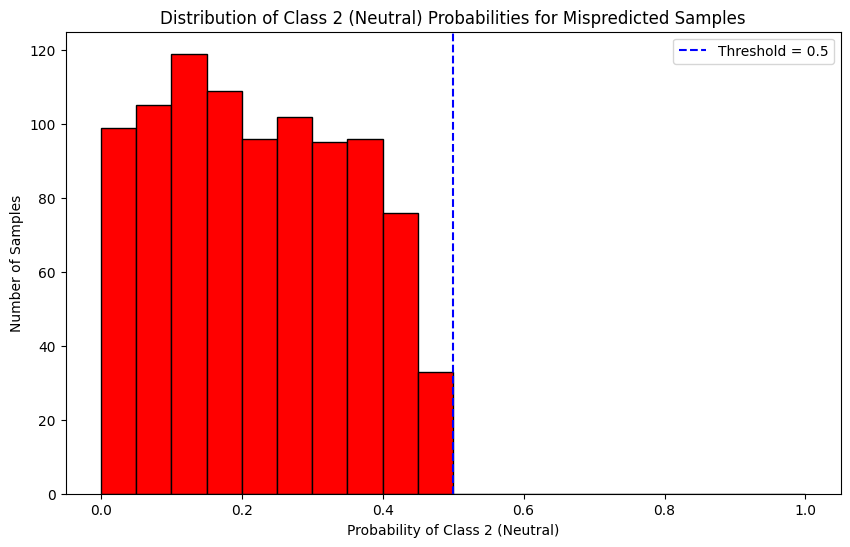
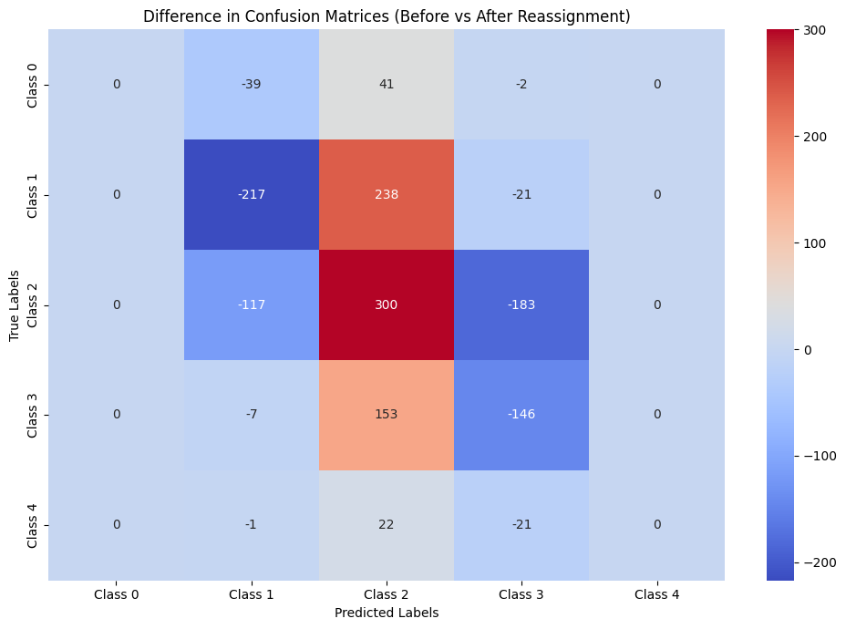
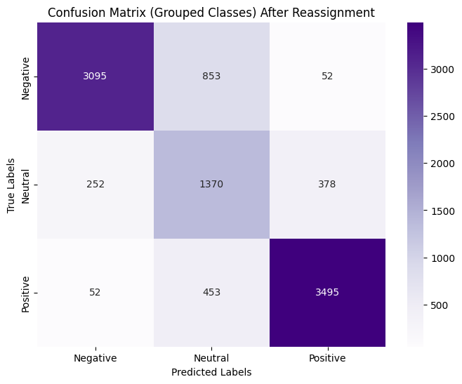

# Multiclass Sentiment Classification with BERT 🚀
---

## 📑 Table of Contents

1. [🏁 Summary](#-summary)  
2. [🌟 Features](#-features)  
3. [📊 Dataset](#-dataset)  
4. [⚙️ Setup and Installation](#%EF%B8%8F-setup-and-installation)  
5. [🏋️ Training the Model](#%EF%B8%8F-training-the-model)  
6. [📈 Evaluation](#-evaluation)
7. [💡 Hyperparameters & Optimizer](#hyperparameters--optimizer) 
8. [🔮 Results](#-results)
9. [⚠️ Problems](#%EF%B8%8F-problems)
10. [📌 Limitations](#-limitations)  
11. [🔧 Future Work](#-future-work)  
12. [🤝 Information](#-information)  
13. [📜 License](#-license) 

---
## 🏁 Summary

This project implements a multiclass sentiment classification model using BERT. The project began with simple regression and classification models implemented in **Python**, but we quickly moved to developing in **Google Collab**, when the training data size increased and we needed GPU acceleration.


## **Key Points of the Project** 🔑
- **Deep Learning**: Fine-tuning BERT for sentiment classification.
- **Sentiment Analysis**: Multiclass and grouped-class analysis.
- **Data Visualization**: Visualization of the data and results


## **Initial Goals and Evolution** 🚩

The initial goal of this project was to create a **regression model** that could predict a percentage score indicating how positive or negative a sentence or text was. However, as the project evolved, we realized that a **classification-based approach** would be more effective for this task. We then adapted the model's output and usage to fit different needs based on its use case.


## **Exploring Sentiment Classes**

Initially, we explored **multiclass sentiment analysis** using five classes to categorize sentiment with greater granularity. However, we found this approach to be quite challenging due to the fact how differently people think about sentiment and this showed in the training data. To simplify and improve the model's accuracy, we transitioned to using **three broader classes**: **Positive**, **Neutral**, and **Negative**. This helped categorize the sentiment even better and make the data more reliable


### **Model Accuracy Comparison**

| Approach           | Number of Classes | Accuracy | Notes                              |
|--------------------|-------------------|----------|------------------------------------|
| **5-class model**  | 5                | 63%      | Difficulty in distinguishing subtle sentiment variations. |
| **3-class model**  | 3                | 81%      | Improved accuracy and generalization. |

---

## 🌟 Features
✨ **Fine-tuned BERT** for multiclass sentiment classification.  
✨ **Deep Learning** with Google Colab.  
✨ **Detailed Evaluation Metrics**: Accuracy, Precision, Recall, F1-score, and Confusion Matrix.  
✨ **Example Predictions** for real-world testing.

---

## 📊 Dataset

- **Source**: [Yelp Reviews for SA Fine-Grained 5 Classes on Kaggle](https://www.kaggle.com/datasets/yacharki/yelp-reviews-for-sa-finegrained-5-classes-csv/data)  
- **Total Size**: 650,000 examples  
- **Used Dataset**: 50,000 examples (training, validation, and test sets)  
- **Classes**: Ratings from **1** to **5**  

### **Dataset Details**  

The dataset comes with 600 000 training instances and a seperate test set of 50 000, but for this project, I chose to work with a subset of 50,000 examples from the entire dataset. The data was split into **training**, **validation**, and **test** sets, keeping the splits **stratified** to maintain class balance.

---

### **Training Data Split**  
The training data was split while ensuring class stratification. Each subset maintains a balanced distribution of all five sentiment classes. This approach ensures fair performance evaluation and improves model training stability.

### **Dataset Shapes**
| Subset      | Number of Samples | Shape    |
|-------------|-------------------|----------|
| **Train**   | 50,000            | (50,000, 2) |
| **Validation** | 10,000         | (10,000, 2) |
| **Test**    | 10,000            | (10,000, 2) |

### Graphs showing the datasplit


---

### **Example Data Snippet**  

| Input Text                              | Sentiment Rating |
|-----------------------------------------|------------------|
| "This product exceeded my expectations!"| 5 (Positive)     |
| "It was okay, nothing special."         | 3 (Neutral)      |
| "Terrible service, very disappointed."  | 1 (Negative)     |

---


---

## ⚙️ Setup and Installation


Open the project in Google Colab by clicking the badge below:  
[](https://colab.research.google.com/drive/10cUKwI2EQz7RsqNm2nf_hkW8tqLl_aYF?usp=sharing)

Most of the blocks contains all the steps to use the model. Some imports are added and some blocks can function on their own. Have fun and look around the blocks and explore all the different solutions and visuals

---

### 🗂️ **Loading the Dataset**

To start training, you'll need to load the dataset [Yelp Reviews for SA Fine-Grained 5 Classes on Kaggle](https://www.kaggle.com/datasets/yacharki/yelp-reviews-for-sa-finegrained-5-classes-csv/data)  into the Colab environment. Since the dataset is too large to include directly in the notebook, you will need to connect your **Google Drive** and access the data stored there. 

There is already a block in the notebook to connect your Google Drive. Once connected, navigate to the location where your dataset is stored in your Drive and load it into the environment.

1. **Mount Google Drive**
   The block in the notebook will allow you to mount your Google Drive. Once connected, you can access the dataset from your Drive.
 ```python
from google.colab import drive
drive.mount('/content/drive')
 ```
2. **Load the Dataset**:
   After mounting Google Drive, use the appropriate path to load the dataset. Example:
```python
   #Load train and test datasets
   train_data = pd.read_csv("/content/drive/My Drive/yelp_review_fine-grained_5_classes_csv/train.csv")
   test_data = pd.read_csv("/content/drive/My Drive/yelp_review_fine-grained_5_classes_csv/test.csv")
```
---

## 🏋️ Training the Model

### My model 🤖
I trained my final model with a training set of the size 50 000. Unfortunately the model is too large to upload straight to GitHub. This is the reason why the load model and save model have the name **best_model_50_000**. But good thing is that you can choose to use less or even more data.

### To fine-tune the model:

1. Upload your dataset to Colab (follow the steps in the **Setup and Installation** section to load your dataset).
2. Follow the blocks to setup and handle the data (**tokenization** & **batch size**)
3. Set the training mode:  
```python
TRAIN_MODEL = False  # Set to True to train; False to load and evaluate/predict
```
4. Run the training cell:
5. Evaluate your existing model or train a new one

---

## 📈 Evaluation
The training block has early stopping over a set amount of epochs and prints out the validation loss so we can see if the model is improving each epoch.
After training there is a block to gather all the data from the test set into a dataframe, so we can use it later for visualization and accesing the data easier.
I used **CrossEntropyLoss** as the loss function 

### Dataframe 
This table displays sentiment predictions with associated logits and probabilities for various reviews.

| Index | Text                                       | True Label | Prediction | Logits                                                             | Probabilities                                                    |
|-------|-------------------------------------------------------|------------|------------|--------------------------------------------------------------------|------------------------------------------------------------------|
| 0     | SAGE IS NOW UNDER NEW MANAGEMENT!! Food porti...      | 0          | 0          | [2.1324685, 1.6572948, 0.17278333, -1.5828129,...                | [0.55284214, 0.34374455, 0.077897, 0.013460925...]              |
| 1     | Tried out this joint since I'm a real ramen lo...     | 0          | 1          | [3.413959, 3.4634078, 0.63320374, -2.8047848,...                  | [0.4727253, 0.49668857, 0.029305032, 0.0009415...]              |
           
- **Text**: The review text.
- **True Label**: The actual label for the sentiment (e.g., 0 = negative, 4 = positive).
- **Prediction**: The model's predicted sentiment label.
- **Logits**: The raw output values from the model before applying softmax.
- **Probabilities**: The normalized probabilities for each class, derived from the logits.

This table can be used to evaluate the model's performance and compare predictions with true labels.

## Test accuracy
To evaluate the model, run the following Python code after gathering the dataframe:

```python
import torch
import numpy as np
import torch.nn.functional as F

# Define the loss function (same as used during training)
loss_fn = torch.nn.CrossEntropyLoss()

# Extract logits and true labels from the DataFrame
logits = np.vstack(test_df["logits"])  # Convert list of logits to a numpy array
true_labels = test_df["true_label"].values

# Convert to tensors
logits_tensor = torch.tensor(logits, dtype=torch.float32)
true_labels_tensor = torch.tensor(true_labels, dtype=torch.long)

# Compute the test loss
test_loss = loss_fn(logits_tensor, true_labels_tensor).item()

# Compute the predicted labels
predicted_labels = torch.argmax(logits_tensor, dim=1)

# Calculate accuracy
correct_predictions = (predicted_labels == true_labels_tensor).sum().item()
accuracy = correct_predictions / len(true_labels_tensor)

# Output the results
print(f"Test Loss: {test_loss:.4f}")
print(f"Accuracy: {accuracy * 100:.2f}%")

```
```python
Test Loss: 0.8480
```
---

## 💡Hyperparameters & Optimizer:
I used Optuna to find the hyperparameters for the training model. I first tried things myself to find a good direction to look for the optimal parameters. 
I initally searched for learning rate , weight decay, batch size and dropout. This turned out to be extremely time consuming. So I decided to focus on dropout and learning rate. I also tested freezig some of the initial layers so I wouldnt have to look for the weights on those layers and most of the tuning was focused on the last fine-tuning layers.


### **Summary of Model Settings**  


| Setting                 | Value                           |
|-------------------------|---------------------------------|
| **Optimizer**            | AdamW                           |
| **Learning Rate**       | 1.7e-5                          |
| **Weight Decay**        | 0.01                            |
| **Loss Function**       | CrossEntropyLoss                |
| **Dropout Probability** | 0.2                             |
| **Frozen Layers**       | First 4 layers of BERT encoder  |


```python
if TRAIN_MODEL:
    # Initialize model, optimizer, and loss
    model = BertForSequenceClassification.from_pretrained(
        'bert-base-uncased',
        num_labels=5,
        hidden_dropout_prob=0.2
    ).to(device)

    optimizer = AdamW(model.parameters(), lr= 1.7e-5 , weight_decay=0.01)
    loss_fn = torch.nn.CrossEntropyLoss()

    #Freeze the first 4 layers of BERT encoder
    for param in model.bert.encoder.layer[:4].parameters():
      param.requires_grad = False
```

---

## 🔮 Results:

### 5-Class Classification Report:
The initial classification task involved 5 distinct classes. The performance metrics for these are as follows:

| Class | Precision | Recall | F1-Score | Support |
|-------|-----------|--------|----------|---------|
| 0     | 0.74      | 0.80   | 0.77     | 2000    |
| 1     | 0.59      | 0.47   | 0.52     | 2000    |
| 2     | 0.56      | 0.54   | 0.55     | 2000    |
| 3     | 0.54      | 0.59   | 0.56     | 2000    |
| 4     | 0.71      | 0.76   | 0.74     | 2000    |

#### 5-Class Confusion Matrix:



### Combining Classes into 3 Groups:
The model has a hard time differentiating from the middle classes and neutral (class2).This is understandable since people write and think about reviews differently, also the line can be quite subtle. So, to better represent sentiment, the five original classes were grouped into combined categories:

1. **Negative**: Combines Classes 0 and 1.
2. **Neutral**: Maps directly from Class 2.
3. **Positive**: Combines Classes 3 and 4.

This is a nice static to look at, and we get some variance from adding the neutral, but this also causes some downsides.

### 3-Class Classification Report:
After combining classes, the performance improved significantly:

| Sentiment | Precision | Recall | F1-Score | Support |
|-----------|-----------|--------|----------|---------|
| Negative  | 0.89      | 0.84   | 0.86     | 4000    |
| Neutral   | 0.56      | 0.54   | 0.55     | 2000    |
| Positive  | 0.85      | 0.92   | 0.88     | 4000    |

- **Accuracy**: Achieved an accuracy of 80.83%.

#### 3-Class Confusion Matrix:


### 
- The 3-class grouping provides a cleaner and more balanced understanding of sentiment.
- Improvements in accuracy and F1-score demonstrate the benefits of aggregating classes for sentiment analysis.

---

## ⚠️ Problems
The main issues is definately that it is hard to seperate the middle classes.That is where we see most of the predictions fail in the Confusion matrix.
This is why I made a seperated 3 class representation aswell, but this also has its flaws.

### Neutral class
The problem comes mainly from this neutral class. It is hard to say what is neutral and what is slightly **"negative"** or **"positive"**. This is also even more appearent  when looking at the reviews the model got in this **Neutral** class. We can see in the table below how people often treat this 3 star rating as either negative or positive instead of neutral. This makes this class and the ones next to it hard to predict. 


| Sample | Text Excerpt                                                    | Class Probabilities                  |
|--------|-----------------------------------------------------------------|--------------------------------------|
| 1      | The spice bouquet is strong, but some flaws ruin the flavor.    | 0.0930, 0.1656, 0.2811, 0.3603, 0.1000 |
| 2      | Hate picking up domestic passengers; awful parking and rude staff. | 0.1657, 0.4521, 0.3277, 0.0472, 0.0073 |
| 3      | Chart House had great wines, but tasteless food and poor service. | 0.0194, 0.0669, 0.3058, 0.5037, 0.1043 |
| 4      | Decent burritos, but mediocre food; nothing exceptional stands out. | 0.0444, 0.5364, 0.3846, 0.0294, 0.0052 |

---

### Possible fixes
I thought of a couple ways to combat this issue. Train an enseble model wich would have another trained model specifically to look at these middle classes **or**
make a simple algorhytmn / function to readjust this neutral class. I went with the latter one since this one seems more straight forward.

For this I needed to look at the probability data at these break points and come up with a logic to readjust and hopefully make the model more accurate.
<div style="display: flex; justify-content: space-around; align-items: center;">
    
    
</div>

---

### Neutral class fix result
To not get into the details I made a function to look at if class2 has decently high probability and then compare the midclasses to the extreme classes. The probabilities in the neutral class supported that even if the middle classes (1 & 3 ) had high prob didnt mean the classes (0 & 4 ) would have high probability. Pretty simple solution to an not so simple problem to be fair. **This did not work as well as I thought**. 😢


#### A Confusion matrix showing the change in classes with the reassigned values

<div style="display: flex; justify-content: space-around; align-items: center;">
    
    
</div>

The solution wasnt really working since the reassign function was really basic and the classes (1 & 3) probabilities had their own patterns. Still solution did still shift more instances to be correct on the neutral class so its all about our goals. I have a whole dedicated to this problem solving in the workbook.

---

## 📌 Limitations

⚠️ Limited to English text; performance may degrade with non-English text.  

⚠️ Multiclass sentiment can be really hard to seperate if the class boundaries arent clear.

⚠️ The BERT model tries to even make sense of things that arent words. There is a workaround this though.

---

## 🔧 Future Work

🔹 Try other model like ALBERT or RoBERTa.


🔹 Use enseble methods.


🔹 Train on a larger, more diverse dataset for improved generalization.  

---

## 🤝 Information
- **Project Created By**: Aleksi Häyrynen

This project was made for my OpenSource software course during my exchange in Korean University. This was the first time I got to learn and apply datascience and Artificial intelligence. I wish I could have used even a larger part of the dataset, but the lack of GPU and time in Collab made this almost impossible. 

---

## 📜 License

This project is licensed under the [MIT License](LICENSE). 

---


